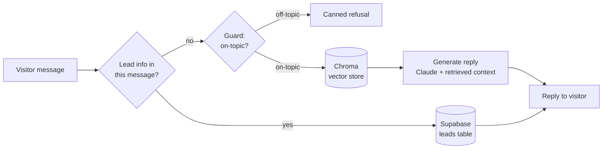

# Soundfabrik Studio Assistant

[](https://github.com/emilioquezadanavarro/soundfabrik-studio-assistant/actions/workflows/unit-tests.yml)

A RAG studio-assistant chatbot for a real Berlin recording studio: guard, retrieve, generate, plus automatic lead capture into Supabase.

**[Live demo →](https://recording-studio-assistant.streamlit.app/)**

> **About this project.** An official project built for Soundfabrik Berlin (a Berlin recording studio) for potential future use, and published here for review as part of my portfolio. The public repository and live demo run on synthetic sample data (`sample-docs/`, a fictional studio called "Master Sound Berlin"). The Soundfabrik Berlin name, branding, logo, and real studio documentation remain the property of the studio and are not included in this repository. The code is source-available and **not licensed for reuse**, see [`NOTICE`](./NOTICE).

## Skills demonstrated

- **RAG pipeline design**: a guard → retrieve → generate flow with each stage as its own testable module (`backend/`).
- **Retrieval evaluation**: recall@5 and MRR measured against a labeled case set, not eyeballed (`evals/retrieval_set.py`).
- **LLM-as-judge evals**: an automated grounded/in-scope judge for answer quality, with a real eval-driven bug fix trail (`evals/quality_set.py`, see Design decisions below).
- **Prompt engineering**: iterative fixes to real failure modes found by the eval suite, cross-room hallucination, scope-leak on refusals, an owner-coverage retrieval gap (`backend/prompts.py`).
- **Guardrails**: a regex-first, LLM-fallback topic guard, plus rate limiting, message-length caps, and history truncation against abuse (`backend/guard.py`, `backend/pipeline.py`).
- **Observability**: end-to-end LLM tracing with LangSmith, named spans per pipeline stage, separate dev/eval/prod projects (`@traceable` throughout `backend/`).
- **Vector search**: Chroma similarity search with regex-based query expansion to catch gear/team questions a narrow phrasing would miss (`backend/retrieve.py`).
- **Testing discipline**: an offline unit suite with no network calls or API keys required, verified by stripping `.env` entirely (`tests/`), plus CI on every push.
- **Third-party integrations**: Supabase for structured lead storage (RLS, service-role auth), Streamlit Community Cloud for deployment.

---

## The problem

A recording studio's public-facing questions (room specs, gear, pricing, booking) are repetitive and time-consuming for staff to answer one by one, but too specific and detail-heavy for a generic FAQ page. Franz answers those questions directly from the studio's own docs, stays strictly on-topic, and hands off to a human the moment a visitor is ready to book, capturing their contact details automatically so nothing falls through the cracks.

## How it works

One turn through the pipeline:



- **Guard** (`backend/guard.py`): regex-first (`STUDIO_TERMS`), LLM-fallback only for ambiguous messages. Saves an API call on the obvious cases.
- **Retrieve** (`backend/retrieve.py`): plain Chroma similarity search, no LLM involved, with regex-based query expansion for gear/team questions so a narrow phrasing doesn't miss a chunk that lives elsewhere.
- **Generate** (`backend/generate.py`): Claude, prompted from `backend/prompts.py`, grounded in the retrieved chunks.
- **Lead capture**: checked on every turn, not just when Franz asks. If a message contains an email or phone number, it's saved to Supabase, whether the visitor volunteered it or was prompted.

Every stage is its own module, and `backend/` has zero Streamlit imports. The whole pipeline runs headless via `python3 scripts/chat.py`, a terminal REPL used for manual smoke testing.

## Project structure

```
soundfabrik-studio-assistant/
├── .github/
│   └── workflows/
│       ├── unit-tests.yml       # runs on every push
│       └── evals.yml            # manual dispatch only, real billed API calls
├── .streamlit/
│   ├── config.toml              # theme config
│   └── secrets.example.toml     # placeholder, real secrets.toml is gitignored
├── backend/                     # guard -> retrieve -> generate -> lead capture, zero Streamlit imports
│   ├── __init__.py
│   ├── config.py                # env-driven paths, models, feature flags
│   ├── guard.py                 # regex-first, LLM-fallback topic guard
│   ├── retrieve.py              # Chroma similarity search, no LLM involved
│   ├── generate.py              # Claude reply generation
│   ├── prompts.py               # system prompts and canned replies
│   ├── leads.py                 # lead extraction + Supabase insert
│   ├── pipeline.py              # handle_turn(): one turn, end to end
│   └── ingestion.py             # markdown -> chunks -> Chroma
├── frontend/                    # Streamlit UI, the only place Streamlit gets imported
│   ├── __init__.py
│   ├── app.py
│   ├── ui.py                    # brand CSS, hero, footer
│   └── secrets_bridge.py        # st.secrets -> os.environ, runs before backend.config loads
├── evals/                       # retrieval / guard / quality suites, real billed API calls
│   ├── __init__.py
│   ├── README.md                # how to run each suite, how to read the report
│   ├── retrieval_set.py
│   ├── guard_set.py
│   ├── quality_set.py
│   ├── runner.py
│   ├── run.py
│   └── results/
│       └── latest.md            # most recent eval report
├── tests/                       # offline unit tests, no network or API keys required
│   ├── conftest.py              # forces LangSmith tracing off before any backend.* import
│   ├── test_generate.py
│   ├── test_guard.py
│   ├── test_leads.py
│   ├── test_pipeline.py
│   └── test_retrieve.py
├── sample-docs/                 # tracked fictional studio content ("Master Sound Berlin")
│   ├── contact.md
│   ├── faq.md
│   ├── home.md
│   ├── services.md
│   ├── studio-a.md
│   ├── studio-b.md
│   └── team.md
├── sample-assets/
│   └── sample-mark.png          # tracked placeholder logo mark
├── scripts/
│   └── chat.py                  # headless terminal REPL for manual smoke testing
├── data/
│   └── leads.example.json       # schema example only, real leads live in Supabase
├── .env.example                 # placeholder env vars for local setup
├── .gitignore
├── CLAUDE.md                    # architecture boundaries and conventions for this repo
├── NOTICE                       # source-available, not licensed for reuse
├── pytest.ini
├── README.md
├── requirements.txt
└── run.py                       # single entrypoint: streamlit run run.py
```

The real studio's content (`studio-docs/`, `studio-assets/`) and this project's own planning tracker are gitignored and never enter this repository; see the About note above.

## Design decisions & tradeoffs

A few choices worth calling out, with the reasoning behind them:

- **Regex-first guard, not LLM-only.** Most in-topic messages ("do you have a Neumann U87?", "what's your address?") are obviously on-topic by keyword alone. Only ambiguous messages hit the classifier. This isn't a redundant check, it's there specifically to save API calls at scale.
- **Env-driven docs source, not a hardcoded path.** `backend/config.py` reads `DOCS_DIR`/`ASSETS_DIR` (default: the tracked `sample-docs/`). The real studio's docs (`studio-docs/`) are gitignored and only used via a local `.env` override, so a fresh clone never needs them to run.
- **Franz's persona is env-driven too** (`STUDIO_NAME`, `STUDIO_ADDRESS`, `STUDIO_WEBSITE`). This one came from a real bug: the frontend's hero/footer originally hardcoded the real studio's name, address, and website link directly in the markup, bypassing the env system entirely. That meant the public sample-data deploy was still showing the real studio's identity. Fixed by routing everything through `backend.config`.
- **Supabase leads, no local-file fallback.** Leads write straight to Supabase (RLS deny-all, `service_role` key bypasses it) with a `try`/`except` that logs and degrades gracefully on failure, rather than a dual-write to a local JSON file. One source of truth, at the cost of losing a lead if Supabase is briefly unreachable. An accepted tradeoff for a portfolio-scale project.
- **Abuse guards live in the shared pipeline, not the UI.** Rate limiting (20 turns/session), a message-length cap, and a history-length cap all live in `handle_turn()` itself, so they apply identically whether the caller is the Streamlit UI or the terminal REPL. No risk of the UI enforcing a limit that a script bypasses.
- **The lead-capture nudge is throttled, not persistent.** Franz used to remind the visitor to share contact details on *every* reply while awaiting a lead, even mid-conversation about something else entirely. It now only repeats every other turn, so a multi-question conversation doesn't feel like it's being interrupted by a sales pitch.

## Engineering Methodology: Spec Driven Development

This project was built using Spec Driven Development (SDD) alongside Claude Code. Instead of allowing the model to generate code unsupervised, the AI was directed turn-by-turn. All architectural decisions, pipeline staging, and validation stayed human-in-the-loop, mine to make and confirm.

Directing a capable LLM is a distinct engineering skill, separate from traditional programming. It requires treating model output as a proposal to check, not an answer to accept. For any non-trivial change, the workflow followed a strict sequence: define the plan in plain language, review the proposed architecture, and confirm the execution steps before generation occurred.

Block E (moving lead storage to Supabase) exemplifies this: schema first, package second, environment variables third, each checked independently before implementation. A model accelerates code production, but it does not replace system comprehension. Below are a few concrete examples where human intervention overruled AI proposals to prioritize cost, UX, and accuracy:

- **Keeping the regex fast path.** `backend/guard.py` checks a message against a keyword list before ever considering an LLM call, and only falls back to the Claude classifier when that check is ambiguous. It would be easy to call that redundant now that the classifier exists and simplify it away. It stays, deliberately: it's a cost control, not a leftover, since most in-topic messages ("do you have a Neumann U87?") are obviously on-topic by keyword alone and don't need an API call to confirm it. That reasoning is written directly into `CLAUDE.md` so it survives the next person (or the next AI session) who looks at that code and is tempted to "clean it up."
- **Reverting the sources-in-UI feature after seeing it render.** Retrieved source filenames (`studio-a.md`, `faq.md`) were already computed on the backend and just never surfaced. Adding a caption under each reply took two lines, and it worked, verified with an actual browser screenshot. Shown a real screenshot, the call was that raw filenames read as internal/debug output in a customer-facing chat, not something a visitor should see. The change was fully reverted in the same session, and the backend still computes the data for tracing and future use, it's just not rendered.
- **Catching a wrong fix from a different AI tool.** A GitHub Copilot suggestion for a CI failure (the Supabase client being built at import time, breaking tests with no credentials) proposed caching the credential lookup inside `backend/config.py`. That looks plausible but doesn't fix anything: the client is still constructed immediately at import either way, so the same `RuntimeError` fires regardless of caching. The actual fix was to defer construction itself, moving it into a lazily-called getter inside `backend/leads.py`, verified by stripping `.env` entirely and re-running the suite. Not every suggestion that compiles is correct, including from another AI.

## Evals

Retrieval, guard, and answer-quality are each checked by a small eval suite (`evals/`) run against the tracked `sample-docs/` set. See [`evals/README.md`](evals/README.md) for how to run them and [`evals/results/latest.md`](evals/results/latest.md) for the full case-by-case breakdown.

| Suite | Metric | Result |
|---|---|---|
| Retrieval (21 cases) | recall@5 / MRR | 1.00 / 0.98 |
| Guard (22 cases) | precision / recall | 1.00 / 1.00 |
| Answer quality (12 cases, LLM-as-judge) | pass rate | 0.92 (11/12) |

The one quality miss ("Can I bring my own DAW?") was flagged `grounded=False` by the judge, a real, known gap rather than a cherry-picked number.

## Tracing

Every turn is traced end-to-end with LangSmith (`@traceable` on `handle_turn`, `retrieve_chunks`, the guard classifier, and `generate_reply`), across three separate projects (`-dev`, `-evals`, `-prod`) so local testing, eval runs, and the live deploy never mix traces.

## Local setup

```bash
git clone https://github.com/emilioquezadanavarro/soundfabrik-studio-assistant.git
cd soundfabrik-studio-assistant
python3 -m venv .venv && source .venv/bin/activate
pip install -r requirements.txt
cp .env.example .env   # fill in OPENAI_API_KEY, ANTHROPIC_API_KEY, SUPABASE_URL, SUPABASE_SERVICE_ROLE_KEY
streamlit run run.py
```

No real studio content is required. The app runs entirely on the tracked `sample-docs/`/`sample-assets/` fictional set out of the box.

Other useful commands:

```bash
python3 scripts/chat.py   # headless terminal REPL, no UI, real API calls
pytest                    # offline unit tests, no API keys needed
python3 evals/run.py      # real, billed eval suite (see evals/README.md)
```

**Note:** the live demo runs on Streamlit Community Cloud's free tier, which sleeps after a period of inactivity. The first request after a while may take 10 to 30 seconds to wake the app back up.

## Coming soon

Ordered by priority for the studio's actual business case, not build order:

1. **Automatic follow-up on lead capture.** A lead that sits unanswered for hours is a lead that books somewhere else. Trigger a confirmation message (email/SMS) the moment a row lands in Supabase, via n8n or a similar automation tool.
2. **Lead-qualification agent.** Structured extraction (project type, dates, budget signal) from the full conversation, with a handoff decision, so staff open a ready-to-quote summary instead of a raw transcript.
3. **Docs source switch.** `config.py` reads a `DOCS_SOURCE` setting, `local` (default, the tracked `sample-docs/`) or `supabase` (pull the real studio docs from a private table at ingest time), so the live deploy can serve the real content without it ever touching this repo. Needed before this stops being a demo and starts being the studio's actual assistant.
4. **German language support.** The studio's real visitors are largely Berlin-based; answering only in English is a real access gap, not a nice-to-have.
5. **Adversarial / prompt-injection eval set.** A public-facing chatbot is a public attack surface; this closes the gap between "works in testing" and "holds up against a motivated visitor."
6. **Conversational query rewriting.** Resolve follow-ups ("what about Studio B?") against history before retrieval, so a multi-turn conversation doesn't lose accuracy partway through.
7. **Retrieval-quality experiments.** Sweep `k`, add a reranker, keep pushing recall@k up as the real doc set grows past the sample size.
8. **Turn-level analytics.** Question, latency, tokens, sources, on-topic, lead-triggered, logged to Supabase, so the studio can see what visitors actually ask instead of guessing.
9. **Section-level citations** via `MarkdownHeaderTextSplitter`, for answers that point back to a heading, not just a file.
10. **Response streaming in the UI**, for perceived latency on longer answers.
11. **Anthropic prompt caching** on the system prompt/context prefix, a cost optimization with no visitor-facing effect.
12. **Full-stack variant**: FastAPI backend + JS frontend + a real DB, only worth it if this outgrows Streamlit's ceiling.

## Stack

Python · Streamlit · LangChain · LangSmith · Chroma DB · OpenAI embeddings · Claude API · Supabase

Currently running on `claude-haiku-4-5` for both generation and the guard classifier (`ANTHROPIC_CHAT_MODEL`/`ANTHROPIC_GUARD_MODEL` in `backend/config.py`), chosen for cost at this scale. Swappable per the eval suite's results if a larger model shows a meaningful quality gain worth the tradeoff.

---

Built by Emilio Quezada - 2026

[LinkedIn](https://www.linkedin.com/in/emilioquezadanavarro/) · [emilioquezada.com](https://www.emilioquezada.com) · [contact@emilioquezada.com](mailto:contact@emilioquezada.com)
